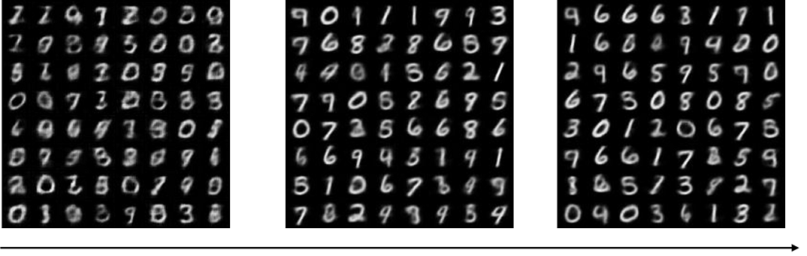

# imle_and_glo

Simple implementation of papers "Implicit maximum likelihood estimation", "Optimizing the latent space of generative networks" and their combination.

## Result

### Training
#### IMLE

#### GLO

### Random sample

#### IMLE

#### GLO

#### IMLE+GLO(use IMLE to generate the latent code of GLO)

